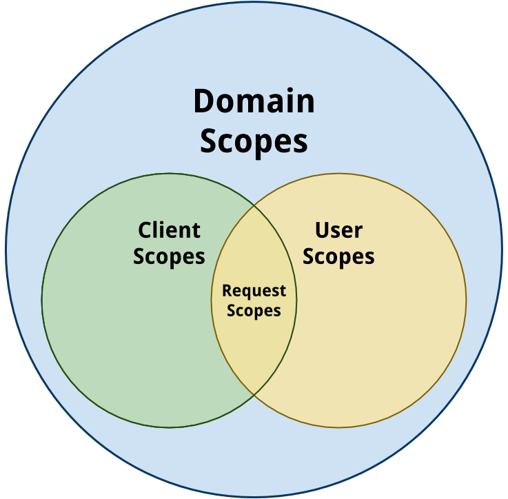
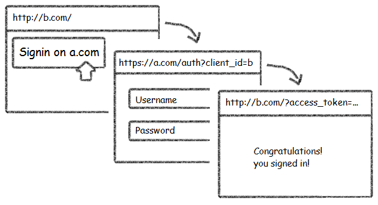
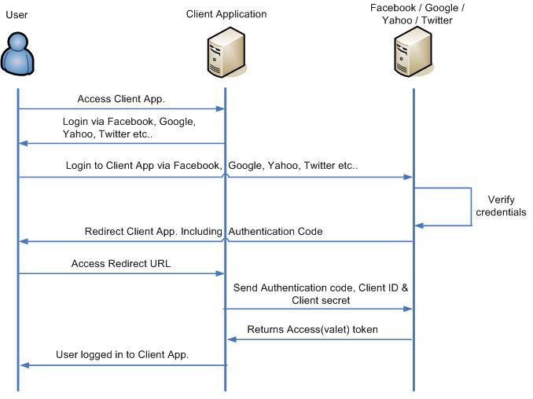

# Conceptos básicos: Autenticación y autorización

El objetivo de este documento es la de reflejar los conceptos básicos que implementa corbel.

## Dominios, clientes y usuarios

corbel cuenta con una estructura organizativa para gestionar los diferentes dominios, aplicaciones y usuarios. Definimos dentro de la terminología corbel:

* **Domain**: un dominio/producto gestionado dentro de corbel
* **Client**: una de las aplicaciones perteneciente a un Domain
* **User**: uno de los usuarios perteneciente a un Domain


### Ejemplos

La lista de dominios, clientes y usuarios quedarán almacenadas en la base de datos de IAM. A continuación se muestra un ejemplo de `Domain`, `Client` y `User` que usaremos para siguientes ejemplos:

* **iam.domain**


{
    "_id" : "orpheus",
    "createdBy" : "IamSell on integration-silkroad-app.dev",
    "createdDate" : ISODate("2014-02-26T15:02:13.383Z"),
    "description" : "Domain for Orpheus",
    "scopes" : [
        ...
    ]
}


* **iam.client**


{
    "_id" : "d2d9eda7",
    "createdBy" : "IamSell on integration-silkroad-app.dev",
    "createdDate" : ISODate("2014-02-26T15:02:14.615Z"),
    "domain" : "orpheus",
    "key" : "26dbeb5dcf12e4d3909f8db3435d27d300b256e515b147bbba960dec1d627a2a",
    "name" : "orpheus-web",
    "scopes" : [
       ...
    ],
    "signatureAlgorithm" : "HS256"
}


* **iam.user**


{
    "_id" : "74427e62a44dc48ae8da70d2f3da996d",
    "createdBy" : "IamSell on integration-silkroad-app.dev",
    "createdDate" : ISODate("2014-02-26T15:02:10.020Z"),
    "domain" : "orpheus",
    "email" : "silkroad.qa@gmail.com",
    "firstName" : "silkroad-qa",
    "scopes" : [
        ...
    ],
    "username" : "SilkroadUser"
}



----------


## Scopes

Llamamos **Scopes** al mecanismo genérico que permite realizar el control de acceso a los diferentes recursos de cada módulo de corbel. Puesto que corbel es una plataforma de contenidos digitales genérica, el mecanismo de gestión de acceso está pensado para adaptarse a cualquier situación.

Scopes se implementa mediante una serie de reglas, donde todos los accesos estarán prohibido salvo que cumplan con al menos un Scope. Cada Scope contará con un nombre único dentro del sistema. Todas la peticiones que se realizan a los módulos corbel han de contener un **accessToken** generado por IAM a partir de las credenciales de clientes y usuarios. A la hora de generar el accessToken, se pedirá a IAM la lista de Scopes que se requieran, lista que se comprobará si es legal de acuerdo a la configuración interna que más tarde se detallará.

Los Scopes permiten controlar el acceso de las siguientes formas:

* Control a nivel de módulo de corbel
* Control a nivel de tipo de dato (Content-Type) de la petición
* Control a nivel de método HTTP
* Control a nivel de URIs
  * Soporte de expresiones regulares
  * Soporte de plantillas
     * Reemplazo por identificación de usuario

Antes de continuar, veamos como se define en corbel los conceptos de dominio (o producto), aplicaciones y usuarios.


### ¿Cómo se definen?

Por definición de Scopes entendemos dos procesos:

* Definición de dónde aplica cada Scope, es decir, la lista de Scopes soportados por cada `Domain`, `Client` y `User`
* Definición de cómo se define cada Scope: reglas de acceso


La definición de cada Scope también quedará almacenada en la base de datos de IAM. Para describir cómo se define un Scope concreto, partamos de un ejemplo:

**iam.scope**


{
    "_id" : "resources:music:streaming",
    "audience" : "http://resources.bqws.io",
    "rules" : [
        {
            "mediaTypes" : [
                "audio/mp3",
                "audio/aacp"
            ],
            "methods" : [
                "GET"
            ],
            "type" : "http_access",
            "uri" : "v.*/resource/music:Track/.*"
        }
    ]
},
{
    "_id" : "resources:music:edit_playlist",
    "audience" : "http://resources.bqws.io",
    "rules" : [
        {
            "mediaTypes" : [
                "application/json"
            ],
            "methods" : [
                "PUT",
                "POST"
            ],
            "type" : "http_access",
            "uri" : "v.*/resource/music:Playlist/{{userId}}-.*"
        },
        {
            "mediaTypes" : [
                "application/json"
            ],
            "methods" : [
                "POST"
            ],
            "type" : "http_access",
            "uri" : "v.*/resource/music:Playlist/?"
        }
    ]
}


En este ejemplo podemos ver que se han definido dos Scopes : `resources:music:streaming` y `resources:music:edit_playlist`.

Para ellos se ha registrado:

* `audience`: Indica en qué módulo de corbel aplica este Scope. Los valores pueden ser:
  * `http://iam.bqws.io` para el módulo de autenticación **IAM**
  * `http://resources.bqws.io` para el módulo recursos **Resources**
  * `http://evci.bqws.io` para el módulo de notificaciones **EVCI**
  * `http://ec.bqws.io` para el módulo de comercio electrónico **EC**

* `rules`: Lista de reglas que se aplican para ver si la petición se ajusta al Scope (sirve con una de la lista para que sea válido):
    * Cada regla es un diccionario con los siguientes campos:
        * `mediaTypes`: formato de datos que ha de llevar la petición
        * `methods`: Lista de operaciones HTTP permitidas en el Scope
        * `type`: tipo de acceso
        * `uri`: ruta de acceso. Las rutas soportan:
            * Expresiones regulares, como por ejemplo `v.*/resource/music:Playlist/?`
            * Plantillas, como por ejemplo  `v.*/resource/music:Playlist/{{userId}}-.*`

De esta forma si un Domain, Client y User contienen el Scope `resources:music:edit_playlist`, y se obtiene un `accessToken` de IAM con el correspondiente Scope la siguiente petición sería válida:


curl 'http://resources-int.bqws.io/v1.0/resource/music:Playlist/'
    -H 'Authorization: Bearer token'
    -H 'Content-Type: application/json'
    -H 'Accept: application/json'
    --data "{playlist:my_playlist}"



----------


### ¿Dónde aplican?


Los Scopes se pueden aplicar tanto a `Domain`, como `Client` o `User`, para conseguir así la configuración de acceso deseada. El uso de los Scopes en los diferentes niveles implica:

* **Domain**: Cada Domain podrá definir todos los Scopes que se van a utilizar para un producto concreto.
* **Client**: Cada Client podrá definir sus propios Scopes, siempre y cuando sean un subconjunto de los del Domain al que pertenece.
* **User**:  Cada User podrá definir sus propios Scopes como un subconjunto de los del Domain al que pertenece.

Finalmente, una petición utilizará la intersección de los Scopes definidos por `Client` y `User`, que a su vez será un subconjunto de los Scopes definidos por `Domain`.



La lista de Scopes quedará almacenadas en la base de datos de IAM. Esta lista contendrá los nombre únicos que identifican a cada Scope. A continuación se muestra un ejemplo con las entradas necesarias en la base de datos para definir una serie de Scopes para un `Domain`, `Client` y `User`:


**iam.domain**


{
    "_id" : "orpheus",
    "createdBy" : "IamSell on integration-silkroad-app.dev",
    "createdDate" : ISODate("2014-02-26T15:02:13.383Z"),
    "description" : "Domain for Orpheus",
    "scopes" : [
        "resources:music:read_catalog",
        "resources:music:edit_playlist",
        "resources:music:streaming",
        "iam:user:create",
        "iam:user:delete",
        "iam:user:read"
    ]
}


**iam.client**


{
    "_id" : "d2d9eda7",
    "createdBy" : "IamSell on integration-silkroad-app.dev",
    "createdDate" : ISODate("2014-02-26T15:02:14.615Z"),
    "domain" : "orpheus",
    "key" : "26dbeb5dcf12e4d3909f8db3435d27d300b256e515b147bbba960dec1d627a2a",
    "name" : "orpheus-web",
    "scopes" : [
        "resources:music:read_catalog",
        "resources:music:edit_playlist",
        "resources:music:streaming",
        "iam:user:create",
        "iam:user:read"
    ],
    "signatureAlgorithm" : "HS256"
}


**iam.user**


{
    "_id" : "74427e62a44dc48ae8da70d2f3da996d",
    "createdBy" : "IamSell on integration-silkroad-app.dev",
    "createdDate" : ISODate("2014-02-26T15:02:10.020Z"),
    "domain" : "orpheus",
    "email" : "silkroad.qa@gmail.com",
    "firstName" : "silkroad-qa",
    "scopes" : [
        "resources:music:read_catalog",
        "resources:music:edit_playlist",
        "iam:user:create",
        "resources:music:streaming"
    ],
    "username" : "SilkroadUser"
}


En dicho ejemplo observamos que:

  * Se ha definido un dominio con nombre de producto orpheus que permite realizar una serie de acciones correspondientes a la lista de Scopes:
     * `resources:music:read_catalog`
     * `resources:music:edit_playlist`
     * `resources:music:streaming`
     * `iam:user:create`
     * `iam:user:delete`
     * `iam:user:read`
  * Cabe destacar que estos Scopes son nombres únicos que designan a un Scope, y a pesar de tener un nombre relevante, no aportan nada a la semántica de la regla.
  * Se ha definido un cliente para el dominio `orpheus`  denominado `orpheus-web` , que podrá hacer todas las operaciones definidas en su dominio, salvo `iam:user:delete`, lo que significa que `orpheus-web`  no podrá llevar a cabo la acción definida por las reglas `iam:user:delete`.
  * Se ha definido un usuario para el dominio `orpheus` denominado `SilkroadUser` que podrá hacer todas las operaciones definidas en su dominio, salvo `iam:user:delete`, lo que significa que `orpheus-web` no podrá llevar a cabo la acción definida por las reglas `iam:user:delete` y `iam:user:read`.

### Scopes compuestos

Es posible definir scopes que engloben a varios scopes. Una definición válida de scope compuesto podría ser:

{
   _id: "bitbloq:web",
   type: "composite_scope",
   rules: [],
   scopes: [
       "resources:bitbloq:avatar:edit",
       "evci:comp:base",
       "resources:bitbloq:program",
       "resources:bitbloq:boards",
       "iam:comp:base",
       "resources:bitbloq:avatar:view",
       "resources:bitbloq:project",
       "resources:bitbloq:release"
   ]
}


### Scopes con parámetros configurables

Los scopes soportan parámetros definidos con una expresión regular. Puede verse un ejemplo a continuación:

Supongamos que queremos prestar un libro desde el módulo de préstamos. Esto se haría mediante un asset que permitiría acceder temporalmente a ese libro concreto. Sin los scopes configurables, habría que crear un scope por cada uno de los libros para poder asignarlo en los préstamos; en cambio, con los scopes configurables, sólo tenemos que tener uno para todos los libros. El nuevo scope tendría una forma similar al siguiente:


{
    _id: "borrow:book",
    audience: "http://resources.bqws.io",
    rules: [
        {
            mediaTypes: [
                "application/json"
            ],
            methods: [
                "GET"
            ],
            type: "http_access",
            uri: "v.*/resource/books:Book/{{resourceId}}"
        }
    ],
    scopes: [],
    parameters: {
        resourceId: "[A-Za-z]+"
    }
}


### Scopes básicos por servicios:

Cada uno de los módulos ofrecidos por corbel tiene una funcionalidad susceptible de ser controlada por diferentes Scopes. A continuación se muestran los Scopes que podríamos denominar como genéricos para todos los proyectos:

**Módulo IAM**


{  
    "_id" : "iam:user:delete",
    "audience" : "http://iam.bqws.io",
    "rules" : [
        {
            "mediaTypes" : [
                "application/json"
            ],
            "methods" : [
                "DELETE"
            ],
            "type" : "http_access",
            "uri" : "v.*/user/.*"
        }
    ]
},
{
    "_id" : "iam:user:create",
    "audience" : "http://iam.bqws.io",
    "rules" : [
        {
            "mediaTypes" : [
                "application/json"
            ],
            "methods" : [
                "POST"
            ],
            "type" : "http_access",
            "uri" : "v.*/user/.*/identity/?"
        },
        {
            "mediaTypes" : [
                "application/json"
            ],
            "methods" : [
                "POST",
                "PUT"
            ],
            "type" : "http_access",
            "uri" : "v.*/user(/.+)?"
        }
    ]
},
{
    "_id" : "iam:user:update",
    "audience" : "http://iam.bqws.io",
    "rules" : [
        {
            "mediaTypes" : [
                "application/json"
            ],
            "methods" : [
                "PUT"
            ],
            "type" : "http_access",
            "uri" : "v.*/user/.*"
        }
    ]
},
{
    "_id" : "iam:user:me",
    "audience" : "http://iam.bqws.io",
    "rules" : [
        {
            "mediaTypes" : [
                "application/json"
            ],
            "methods" : [
                "GET"
            ],
            "type" : "http_access",
            "uri" : "v.*/user/me"
        }
    ]
},
{
    "_id" : "iam:user:read",
    "audience" : "http://iam.bqws.io",
    "rules" : [
        {
            "mediaTypes" : [
                "application/json"
            ],
            "methods" : [
                "GET"
            ],
            "type" : "http_access",
            "uri" : "v1.*/user/?(?!me$).*"
        }
    ]
},
{
    "_id" : "iam:token:upgrade",
    "audience" : "http://iam.bqws.io",
    "rules" : [
        {
            "mediaTypes" : [
                "application/json"
            ],
            "methods" : [
                "GET"
            ],
            "type" : "http_access",
            "uri" : "v.*/oauth/token/upgrade/?"
        }
    ]
}


**Módulo EC**


{
    "_id" : "ec:product",
    "audience" : "http://ec.bqws.io",
    "rules" : [
        {
            "mediaTypes" : [
                "application/json"
            ],
            "methods" : [
                "GET",
                "POST",
                "PUT",
                "DELETE"
            ],
            "type" : "http_access",
            "uri" : "v.*/product/?.*"
        }
    ]
},
{
    "_id" : "ec:order",
    "audience" : "http://ec.bqws.io",
    "rules" : [
        {
            "type" : "http_access",
            "mediaTypes" : [
                "application/json"
            ],
            "methods" : [
                "GET",
                "POST",
                "PUT",
                "DELETE"
            ],
            "uri" : "v.*/order/{{userId}}",
            "tokenType" : "user"
        }
    ]
},
{
    "_id" : "ec:purchase:user",
    "audience" : "http://ec.bqws.io",
    "rules" : [
        {
            "mediaTypes" : [
                "application/json"
            ],
            "methods" : [
                "GET",
                "PUT"
            ],
            "type" : "http_access",
            "uri" : "v.*/purchase(:?/{{userId}}-.*)?/?$",
            "tokenType" : "user"
        }
    ]
},
{
    "_id" : "ec:purchase:admin",
    "audience" : "http://ec.bqws.io",
    "rules" : [
        {
            "mediaTypes" : [
                "application/json"
            ],
            "methods" : [
                "GET",
                "PUT"
            ],
            "type" : "http_access",
            "uri" : "v.*/purchase/.*",
            "tokenType" : "user"
        }
    ]
},
{
    "_id" : "ec:paymentmethod:user",
    "audience" : "http://ec.bqws.io",
    "rules" : [
        {
            "mediaTypes" : [
                "application/json"
            ],
            "methods" : [
                "GET",
                "POST",
                "DELETE"
            ],
            "type" : "http_access",
            "uri" : "v.*/paymentmethod(:?/{{userId}}-.*)?/?$",
            "tokenType" : "user"
        }
    ]
},
{
    "_id" : "ec:paymentmethod:admin",
    "audience" : "http://ec.bqws.io",
    "rules" : [
        {
            "mediaTypes" : [
                "application/json"
            ],
            "methods" : [
                "GET",
                "POST",
                "DELETE"
            ],
            "type" : "http_access",
            "uri" : "v.*/paymentmethod/.*",
            "tokenType" : "user"
        }
    ]
},
{
    "_id" : "ec:payment:user",
    "audience" : "http://ec.bqws.io",
    "rules" : [
        {
            "mediaTypes" : [
                "application/json"
            ],
            "methods" : [
                "GET"
            ],
            "type" : "http_access",
            "uri" : "v.*/payment(:?/{{userId}}-.*)?/?$"
        }
    ]
},
{
    "_id" : "ec:payment:admin",
    "audience" : "http://ec.bqws.io",
    "rules" : [
        {
            "mediaTypes" : [
                "application/json"
            ],
            "methods" : [
                "GET"
            ],
            "type" : "http_access",
            "uri" : "v.*/payment/.*"
        }
    ]
}


**Módulo EVCI**


{
    "_id" : "evci:event:publish",
    "audience" : "http://evci.bqws.io",
    "rules" : [
        {
            "mediaTypes" : [
                "application/json"
            ],
            "methods" : [
                "POST"
            ],
            "type" : "http_access",
            "uri" : "v.*/event/.*"
        }
    ]
}



----------


## Autenticación

Para hacer uso de cualquier servicio de corbel, es necesario obtener un `accessToken`, para ello, la aplicación debe autenticarse usando el servicio IAM.

Pero para obtener un `accessToken` de IAM es necesario crear un JWT (JSON Web Token)


### Crear un JWT

**JWT** es un estándar que nos permite, de una forma segura, expresar la identidad y las necesidades que tiene el cliente que solicita la autorización de acceso. **NO** recomendamos construir el JWT a mano porque, aunque es muy sencillo, es posible cometer errores en la codificación y firmado que nos lleven a la frustración. Recomendamos el uso de alguna librería que nos permita hacer esto con un par de lineas de código:

* [Ejemplo Java](https://code.google.com/p/jsontoken/)
* [Ejemplo PHP](https://github.com/firebase/php-jwt)

Para construir un JWT, necesitamos dos JSON:

- El primero es el `header` del JWT, que en nuestro caso puede ser:


{
   "typ":"JWT",
   "alg":"HS256"
}


- El siguiente JSON es el `payload` o `claims` del JWT que para nuestro caso sería:


{
  "iss": "fb2a979d",
  "aud": "http://iam.bqws.io",
  "scope": "evci:event:publish resources:sap:message",
  "exp": TIMESTAMP_NOW_PLUS_EXPIRES
}


  * `iss`: Issuer: El identificador del cliente o clientId
  * `aud`: Audience, A quién va dirigido este JWT, en este caso para `http://iam.bqws.io`
  * `scope`: Scopes que el cliente solicita tener acceso
  * `exp`: Tiempo de valided para el `accessToken` solicitado representado en `epoch_time` actual en segundos más el tiempo de validez (máximo 1h).

- El JWT finalmente se firma con el algoritmo `HMAC SHA256` (o `RS256`) con `secret` como clave para generar el `assertion`:


base64Encode(header) + "." + base64Encode(payload) + "." + sign(base64Encode(header) + "." + base64Encode(payload), clientSecret)


- Este `assertion` es el que se envía como cuerpo al solicitar un `accessToken` junto al `grant_type`. El `grant_type` siempre toma el valor de `urn:ietf:params:oauth:grant-type:jwt-bearer`.


POST https://iam.bqws.io/v1.0/oauth/token
Accept:application/json
Content-Type:application/x-www-form-urlencoded; charset=UTF-8

Form Data (parsed and decoded data)
assertion:_JWT_ASSERTION_
grant_type:urn:ietf:params:oauth:grant-type:jwt-bearer



> **Más info**
>
>   * [IETF](http://self-issued.info/docs/draft-ietf-oauth-json-web-token.html)
>   * [JWT playground](http://jwt.io/)


### Obtener un accessToken

A continuación se describen los diferentes métodos para obtener un `accessToken`, ya sea a través de autenticación básica con IAM, o a través del protocolo OAuth (facebook, google o corbel-oauth).

#### Token Object

`tokenObject` es la estructura de datos que representa un `accessToken`, este está compuesto por:

* `accessToken`: El token propiamente dicho que da acceso a otros recursos.
* `expiresAt`: El tiempo hasta el cual el token es válido.
* `refreshToken`: El token a usar para obtener un `tokenObject` sin tener que generar un JWT completo.


{
    "accessToken":"valid-token",
    "expiresAt": 1385377605000,
    "refreshToken": "refresh-token"
}



#### Básica (IAM Basic)

Para autenticarse en IAM directamente

Dado el siguiente `_JWT_ASSERTION_` generado con el siguiente código JavaScript:


var claims = {
    iss: 'clientId',                    // App identifier
    secret: 'clientSecret',             // App secret
    aud: 'aud': 'http://iam.bqws.io',
    scope: 'scope:operation1 scope:operation2',
    version: '0.0.1'                    // client app version
    claims.exp: getExpiration(),         // Current millis timestamp plus 1h
    'basic_auth.username': 'username',
    'basic_auth.password': 'password',
    'device_id': 'deviceId'             // client device identifier
};

var _JWT_ASSERTION_ = jwt.generate(claims);


Podríamos obtener un `accesToken` directamente con IAM a través de la siguiente petición:


curl 'https://iam.bqws.io/v1.0/oauth/token'
    -H 'Content-Type: application/x-www-form-urlencoded; charset=UTF-8'
    -H 'Accept: application/json'
    --data "assertion=_JWT_ASSERTION_&grant_type=urn%3Aietf%3Aparams%3Aoauth%3Agrant-type%3Ajwt-bearer"



#### Basada en oauth

OAuth es un protocolo open source, que permite autorización segura de una API de modo estándar y simple para aplicaciones de escritorio, móviles y web.
OAuth permite a un usuario del sitio A compartir su información en el sitio A (proveedor de servicio) con el sitio B (llamado consumidor) sin compartir toda su identidad.





1. Crear credenciales de aplicación en el servicio externo
  * Crear aplicación en Facebook [Pendiente]
  * Crear aplicación en Google [Pendiente]
  * Crear aplicación en corbel-js [Pendiente]


2. Redirigir al servicio de oauth externo (Facebook, Google, corbel-oauth)
  * Para el caso de google, abrimos una nueva ventana en la siguiente URL:
    `https://accounts.google.com/o/oauth2/auth?queryString`
  * En `queryString` deben aparecer los siguientes parámetros:
     * `clientId`: Id del cliente,
     * `scopes`: String separado por espacios con los scopes del servicio externo que se solicita (no los de corbel)
     * `response_type`: El tipo de clave del servicio externo que se solicita, en nuestro caso `code`, a intercambiar por un `accessToken`
     * `redirect_uri`: URL a la que redirigir cuando el proceso de autenticación en el servicio externo se complete, ha de ser exactamente la misma que la URL permitida a la hora de crear la aplicación en el servicio externo.


3. Al completarse la autenticación al servicio externo, éste devuelve el `code` del servicio externo para intercambiarlo por un `accessToken` de IAM. Esto se puede lograr de varias formas:

  * Redirect automático a IAM:
    Se puede establecer el anterior campo `redirect_uri` para que apunte directamente a IAM para intercambiar automáticamente el `code` por un `accessToken`, por ejemplo:
    ```
    https://iam.bqws.io/v1.0/oauth/token
    ```
     * Pros: sencillo y automático
     * Contras: al final del flujo termina en una url que devuelve JSON que hay que procesar de alguna forma.

  * Redirect a la aplicación cliente:
    También es posible apuntar a una URL de cliente para que éste procese el `code` devuelto y lo envíe a IAM.
       * Pros: mayor control sobre el flujo y la respuesta.
       * Contras: intercambiar el `code` por el `token` manualmente. Dar soporte a la URL del cliente (web, interceptores, ...)

> **Más info**
> * [OAuth 2.0 Tutorial](http://tutorials.jenkov.com/oauth2/authorization.html)
> * [Google oauth](https://developers.google.com/accounts/docs/OAuth2)
> * [Google oauth for installed apps](https://developers.google.com/accounts/docs/OAuth2InstalledApp)
> * [Google oauth for client-side apps](https://developers.google.com/accounts/docs/OAuth2UserAgent)
> * [Facebook login flow](https://developers.facebook.com/docs/facebook-login/v2.2)


----------


## Assets

Un Asset define un conjunto de scopes que un usuario puede tener durante un periodo de tiempo.
Con este mecanismo, podemos definir scopes dinámicos de recursos a usuarios.
Un ejemplo de Asset sería el siguiente:


{
   _id: "0b2dff5c39934c210d80056a94eb27bc6c6d6378",
   userId: "fooid",
   name: "assettest13",
   productId: "producttest13",
   expire: ISODate("2025-01-01T00:01:00Z"),
   active: true,
   scopes: [
       "ec:purchase:user"
   ]
}


### Incrementar scopes con assets

Una vez autenticado, para poder obtener accesos a los scopes que nos dan acceso a los assets, tenemos que realizar una petición a:


GET https://assets.bqws.io/v1.0/asset/access
Accept:application/json
Authorization: Bearer accessToken


Esta petición redirigirá automáticamente a IAM para obtener un accessToken con accesos incrementados (en función de los assets).


----------


## Referencia

### [Apiary](http://docs.silkroadiam.apiary.io/)

### [Blog](https://confluence.bq.com/display/SILKROAD/SilkRoad+Home)

### [Issues](https://jira.bq.com/secure/RapidBoard.jspa?rapidView=147&view=detail)

### Endpoints del entorno de desarrollo

* IAM: https://iam-qa.bqws.io
* EVCI: https://evci-qa.bqws.io
* RESMI: https://resources-qa.bqws.io
