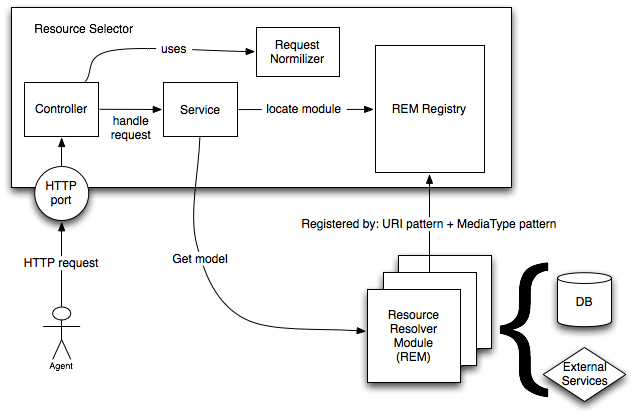

# Resources API

La API de recursos en corbel está implementada sobre una interfaz muy flexible que permite servir cualquier tipo de representación de un recurso. Usando los patrones definidos por esta API, se puede desplegar cualquier tipo de recurso con un impacto mínimo sobre los clientes y servidor.

## Versionado

El primer nivel de todas las URL de la API es siempre la versión de ésta última, y tiene la forma v{número}. Todas las URLs contenidas en este documento se expresan partiendo de ĺa versión como raíz


https://resources-staging.bqws.io/v1.0/resource/media:Track/555


## URIs: completas vs forma canónica

Todo recurso en la API se identifica a través de su URI. En corbel, por razones prácticas, siempre utilizamos la forma canónica de la URI (canonical form), formada por namespace:id, en lugar de la URI 'completa' (fully qualified name). Los namespaces se definen mediante la propia API y los clientes los pueden consultar en /api/namespaces

### Ejemplo namespaces


{
    "media": "http://ontology.bqreaders.com/media/",
    "product": "http://ontology.bqreaders.com/product/",
    "entity: "http://ontology.bqreaders.com/entity/",
    "api": "http://ontology.bqreaders.com/api/"
}


Con estos namespaces podríamos crear las siguientes formas canónicas

|URI|Canonical form|
|---|---|
|http://ontology.bqreaders.com/media/Album|media:Album|
|http://ontology.bqreaders.com/product/Cellphone/aquaris5|product:Cellphone/aquaris5|
|http://ontology.bqreaders.com/entity/Publisher/planeta|entity:Publisher/planeta|
|http://ontology.bqreaders.com/api/limit|api:limit|

----------

# URI templates

corbel cuenta únicamente con 3 formas diferentes de URL

* **Collection**: conjunto de recursos. URI template: /resource/{collection}


/resource/media:Track
/resource/product:Cellphone
/resource/entity:Artist


* **Resource**: recurso particular. URI template: /resource/{collection}/{resource_id}


/resource/media:Track/555
/resource/product:Cellphone/aquaris5
/resource/entity:Artist/123


* **Relation**: relación entre un recurso particular y una colección. URI template: /resource/{collection}/{resource_id}/{relation_collection}
Para referirse a un recurso de la relación en particular, se hace mediante un matrix param "r" con el template {relation_collection}/{resource_id}


/resource/media:Album/456/media:Track
/resource/media:Book/555/media:Author
/resource/media:Videogame/asdf/media:Related;r=media:Related/123


----------

# Parámetros de la petición

La petición puede contener parámetros que modifican la representación de la respuesta. Dichos parámetros deben ser especificados mediante su forma canónica.

## Parámetros permitidos

|Option|Description|Possible Values|Example|
|---|---|---|---|
|api:pageSize|Limits the number of resources returned from a collection in one page|Positive Integer|/resource/entity:Artist/456/albums?api:pageSize=5|
|api:page|The page of the results returned from a collection|Positive Integer|/resource/entity:Artist/456/albums?api:page=5&api:pageSize=5|
|api:sort|Sorts the resources returned in the direction given|JSON String|/resource/media:Artist?api:sort={"meta:releaseDate":"desc"}|
|api:query|Query for a collection of resources. Using the query language described by this document|JSON Query String|/resource/media:Artist?api:query={"meta:label":"The Killers"}|
|api:aggregation|Do aggreagtion operations with the resources|JSON Aggregation String|/resource/media:Artist?api:aggregation={"$count":"*"}|

----------

# API query language

El parámetro api:query permite al cliente realizar filtros en las búsquedas. Dicho parámetro debe ser especificado como JSON Array, no vacío, donde cada elemento es un filtro que se aplicará en la llamada. Cada filtro, a su vez, es un JSON Object que tampoco puede estar sin contenido.

## Filtros

El filtro tiene la siguiente forma:


{
	operador: {
		campo : valor
	}
}


### Operador

El operador representa el filtro que se va a aplicar. Comienzan siempre con el carácter $.

|Operator|Work with|Description|
|---|---|---|
|$eq|primitive|Check if the field and the value are equals|
|$gt|primitive|If the field is greater than the value|
|$gte|primitive|If the field is greater or equal than the value|
|$lt|primitive|if the field is less than the value|
|$lte|primitive|if the field is less or equal than the value|
|$ne|primitive|if the field is not equal to the value|
|$in|array|if the field is in the array of values|
|$all|array|if the field is the same array than the values|
|$like|primitive|Matches if the field is like the value (case insensitive). It admits a regex in the value|
|$elem_match|array|Matches if any of the elements contained in the filed array has a field that matches the given expression: {$elem_match: {field:[{expression}]}}|

### Campo

El campo representa un atributo de la entidad de la colección sobre la que se está aplica el filtro.

### Valor

Representa el valor a filtrar. Consideramos 3 tipos de valor: primitivo, array de primitivos y array de filtros* (solo para $elem_match).

#### Tipos permitidos

* number
* string
* boolean
* date: con el formato definido en la ISO 8601. Para poder diferenciar un campo date de un campo string, el valor debe tener la forma "ISODate(date)".
* period: con el formato definido en la ISO 8601, pero solo soporta periodos a nivel de año, mes y día. Para poder diferencia un campo period de un campo string, el valor debe tener la forma "Period(period)".
* array

#### Ejemplos de valor


2
3.5
"any string"
true
"ISODate(2012-07-14T01:00:00+01:00)"
"Period(P1Y1D)"
[2, 3, 4]


### Ejemplos de filtro


api:query=[{"$gt":{"releaseDate":"ISODate(2013-01-01T00:00:00Z)"}}]
api:query=[{"album":"Octavarium"},{"$lt":{"duration":10}}]
api:query=[{"$in":{"categories":["pop","rock"]}}]
api:query=[{"$like":{"artist":"killers"}}]
api:query=[] //Bad request, empty array
api:query=[{"album":"Scenes form a Memory"},{}] //Bad request, empty filter object.
api:query=[{"album":"Scenes Form a Memory", "artist":"Dream Theater"}] //Bad request, multiple attribute on a filter.
api:query=[{"album":"Scenes Form a Memory"}, {"artist":"Dream Theater"}}] //Good
api:query=[{"$elem_match":{"albums":[{"$in":{"categories":["pop","rock"]}}]}}]


----------

# API aggregation language

El parámetro api:aggregation permite al usuario realizar operaciones de agregación en los listados. Está formado por un JSON Object que contiene un operador y un parámetro:


{
	operador: param
}


|Operator|Parameter|Description|Return|
|---|---|---|---|
|$count|"*"|Count all the elements of the request|{count : n}|
|$count|field: String|Count all the elements of the request that contain the field "field"|{count : n}|
|$avg|field: String|Average the parameter field of the elements of the request|{average: n}|
|$sum|field: String|Sum the parameter field of the elements of the request|{sum: n}|

## Ejemplos de agregación


api:aggregation={"$count":"*"}
api:aggregation={"$count":"field"}
api:aggregation={"$avg":"field"}
api:aggregation={"$sum":"field"}


----------

# Negociación de contenido

En ocasiones, es posible que existan diferentes representaciones de un mismo recurso. Siguiendo los los standards HTTP, un cliente puede obtener la representación que desee mediante el uso de la cabecera Accept en la petición. En el caso de que el cliente no especifique la representación mediante esta cabecera, el servidor siempre tratará de devolver la representación que tiene establecida por defecto: application/json.

Cuando existen múltiples representaciones de un recurso, el servidor devolverá la cabecera Alternates indicando las representaciones disponibles.

## Ejemplo de negociación

El siguiente ejemplo muestra cómo obtener las representaciones disponibles de un determinado recurso de audio

* Client request


HEAD /resource/media:Track/555 HTTP/1.1
Accept: audio/*


* Server response


HTTP/1.1 300 Multiple Choices
Alternates: {"/resource/media:Track/555" 1.0 {type audio/mp3}}, {"/resource/media:Track/555" 0.7 {type audio/audio/x-ms-wmal}}
Vary: negotiate, accept


* Client request


GET /resource/media:Track/555 HTTP/1.1
Accept: audio/mp3


----------

# Implementación

La implementación de la API de recursos se basa en una arquitectura modular que permite la extensibilidad de la API a nuevos dominios mediante un sistema de plugins.

Cuando llega una petición, el servicio recupera un Resource Resolver Module (REM) del registro, que será quien finalmente resuelva la petición, accediendo a base de datos y/o servicios externos.

La selección del REM se realiza en base a la URI + MediaType + HTTP Method. En el caso del MediaType, se escoge aquel REM que sea más específico, por ejemplo, si el cliente en la petición indica image/jpeg, y hay 2 REM candidatos, uno registrado con image/* y el otro con image/jpeg, se escogerá éste último.

Cada plugin puede registrar tantos REM como requiera.

## REM

Hay 3 operaciones que puede implementar un rem: collection, resource y relation. Cada plugin REM implementará aquellas funciones necesarias para la resolución de sus recursos, es decir, no todos los REM tienen por qué implementar las 3 operaciones.

Existen 3 plugin genéricos:

* RESMI. Resuelve todas las peticiones cuyo MediaType sea application/json.

* RESTOR. Resuelve todas las peticiones GET, PUT y DELETE de cualquier MediaType. Este plugin se encarga de gestionar los binarios.

* IMAGE. Resuelve aquellas peticiones GET cuyo MediaType sea image/*. Este plugin se usa para hacer escalados de imagenes.
